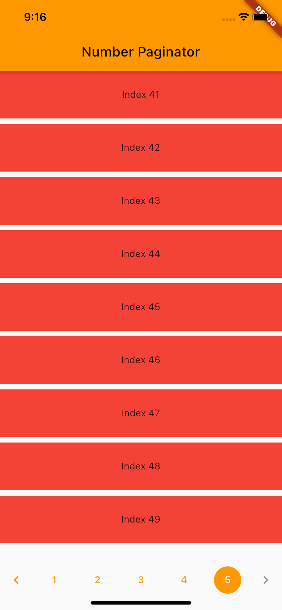

# Number Paginator App Example

A simple Flutter app that shows how to arrange data in a listview page by page with a page selector for switching between the pages.

 
  Please star⭠the repo if you like what you see😉.

## 💻 Requirements

- Any Operating System (ie. MacOS X, Linux, Windows)
- Any IDE with Flutter SDK installed (ie. IntelliJ, Android Studio, VSCode etc)
- A little knowledge of Dart and Flutter

## 📸 ScreenShots

<!--  -->

|                              |                               |
| --------------------------------- | --------------------------------- |
|   |   |

## 🔌 Plugins

| Name                                                    | Usage                                               |
| ------------------------------------------------------- | --------------------------------------------------- |
| [**Number Paginator**](https://pub.dev/packages/number_paginator)       | A Flutter paginator widget for switching between page numbers.                                    |

## 🤓 Author(s)

**Samuel Abada**

## 🔖 LICENCE

[MIT](https://github.com/mastersam07/number_paginator/blob/master/LICENSE)